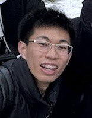
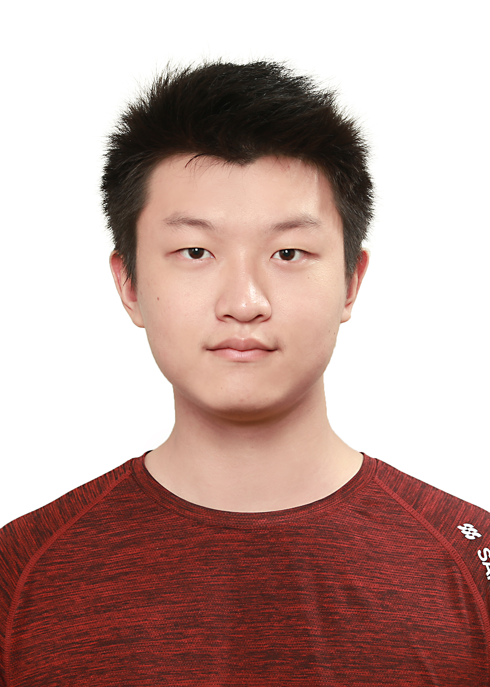
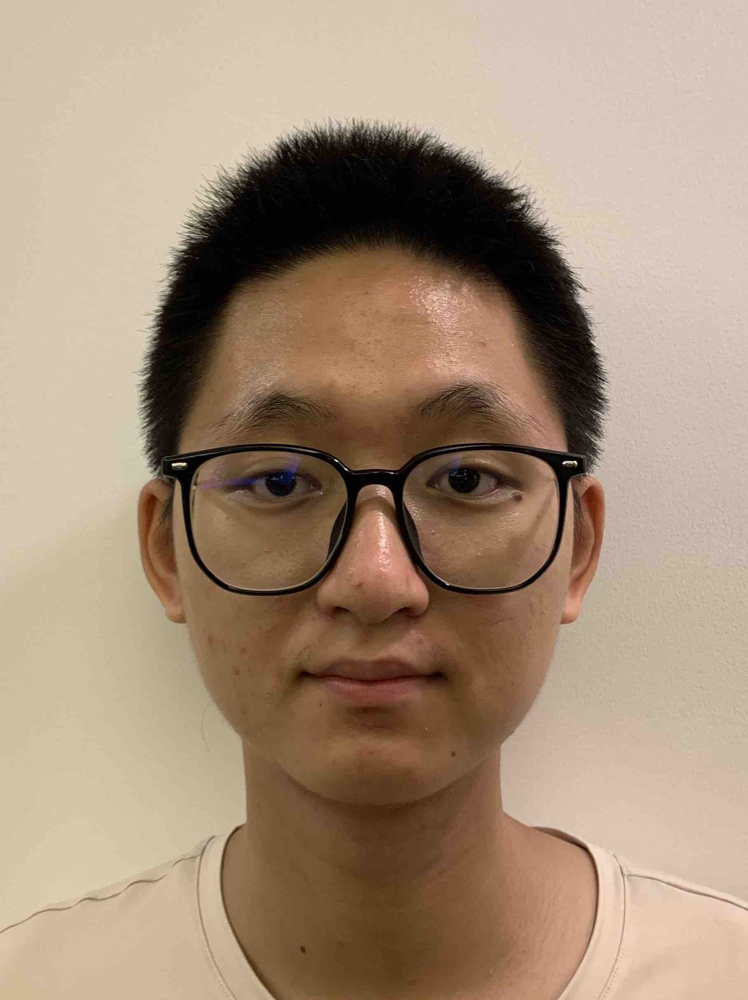
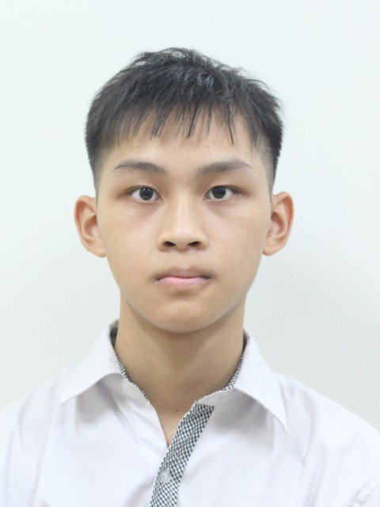

# About Us

We are a team based in the [School of Computing, National University of Singapore](http://www.comp.nus.edu.sg).

You can reach us at the email `seer[at]comp.nus.edu.sg`

## Project team

### Qiming

[[github](https://github.com/ceilingfan456)]
[[portfolio](team/qiming.md)]

* Role: Developer
* Responsibilities: Deliverables and deadlines

### Lekang

[[github](https://github.com/Taoseeker)]
[[portfolio](team/lekang.md)]

* Role: Developer
* Responsibilities: Testing and review code quality

### Deng Tianle

[[github](https://github.com/DengTianle)]
[[portfolio](team/tianle.md)]

* Role: Developer
* Responsibilities: Integration

### Isaac

[[github](https://github.com/Leeisateam)]
* Role: Developer
* Responsibilities: Deliverables

###  Phong

- Role: Backend Developer
- Responsibilities: Improve and maintain app's backend.

 

[[GitHub](https://github.com/nhocmt227)]